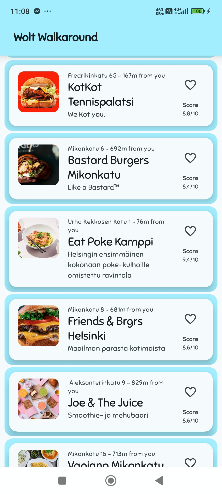
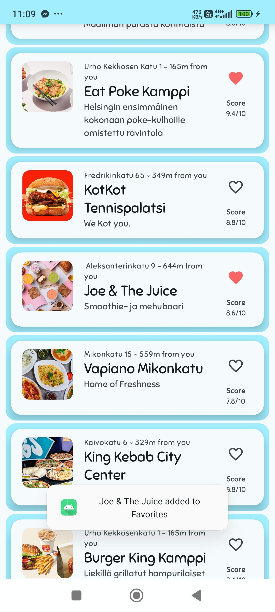

# Solution for Wolt 2025 Mobile (Android) Engineering Internships assignment

Wolt Walkaround is an app that displays a list of nearby restaurants (venues) based on predefined locations by utilizing Wolt API Endpoint

### App screenshots

## How to run the app
**For quick preview:**
* Download the [APK file (Debug build variant)](./WoltWalkaround-debug.apk) to your phone, or transfer it to your phone from the computer if you are connecting them with USB cables
* Install the APK and run the app

**For further inspection using Android Studio:**
* Open the project in Android Studio (author is using Android Studio Meerkat Feature Drop | 2024.3.2 Canary 2)
* Build and compile the project
* Run the module "app" on an emulator or an Android device
